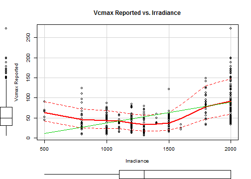

### About the App


Welcome! This application (app) was developed to query databases on several Crops Water Stress and how it affects their yield, and Photosynthesis worldwide. Information like these are scattered, not easy to find, often their quality is questionable and is not available online. Instead, you must download and use locally.

For those reasons, thanks to this application you can:

* Check high quality data sets interactively online.
* Conduct an analysis of correlation between all the variables included.
* Perform a linear regression between the dependent and independent variables, according to user interest.
* Plot the regression model and the results of the analysis.
* Configure a report with the information of interest, the name of user and a brief analysis, in the desired downloadable format.

---

### Using the App


It's very easy! See the app online [here](https://larrylugo.shinyapps.io/DevDataProdProjectFinal). On Side Menu choose a data set, Dependent and Independent Variable:</br>
<div style='text-align: center;'>
    
</div></br>
Then On Main Menu, see output on each corresponding Tab:</br></br>
<div style='text-align: center;'>
    
</div>

---

### A Plotting Example


```r
library(car)
photo <- read.csv(file="./assets/data/Leaf_Photosynthesis_Traits.csv", header=TRUE, sep=",")
scatterplot(Vcmax_reported ~ Irradiance, data=photo, 
   xlab="Irradiance", ylab="Vcmax Reported", 
   main="Vcmax Reported vs. Irradiance")
```



---

### Data Sources 

* Crops water stress: http://wri.org/publication/aqueduct-metadata-global
* Photosynthesis: https://daac.ornl.gov/cgi-bin/dsviewer.pl?ds_id=1224

### References
Gassert, F., M. Luck, M. Landis, P. Reig, and T. Shiao. 2013. "Aqueduct Global Maps 2.0." Working Paper. Washington, DC: World Resources Institute. Available online at http://wri.org/publication/aqueduct-metadata-global.

Walker, A.P., I. Aranda, A.P. Beckerman, H. Bown, L.A. Cernusak, Q.L. Dang, T.F. Domingues, L. Gu, S. Guo, Q. Han, J. Kattge, M. Kubiske, D. Manter, E. Merilo, G. Midgley, A. Porte, J.C. Scales, D. Tissue, T. Turnbull, C. Warren, G. Wohlfahrt, F.I. Woodward, and S.D. Wullschleger. 2014. A Global Data Set of Leaf Photosynthetic Rates, Leaf N and P, and Specific Leaf Area. Data set. Available on-line [http://daac.ornl.gov] from Oak Ridge National Laboratory Distributed Active Archive Center, Oak Ridge, Tennessee, USA. http://dx.doi.org/10.3334/ORNLDAAC/1224
